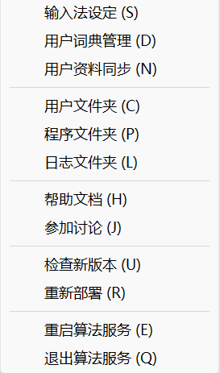
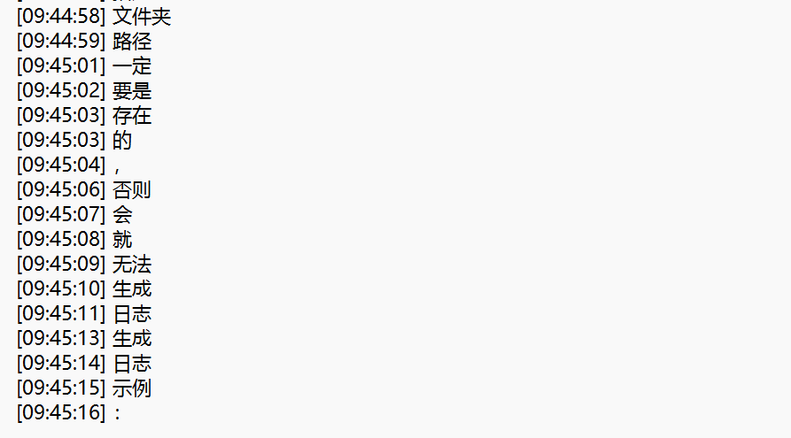
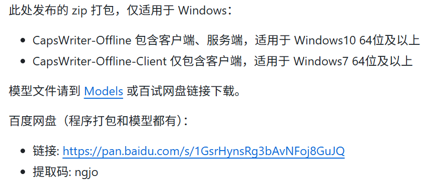
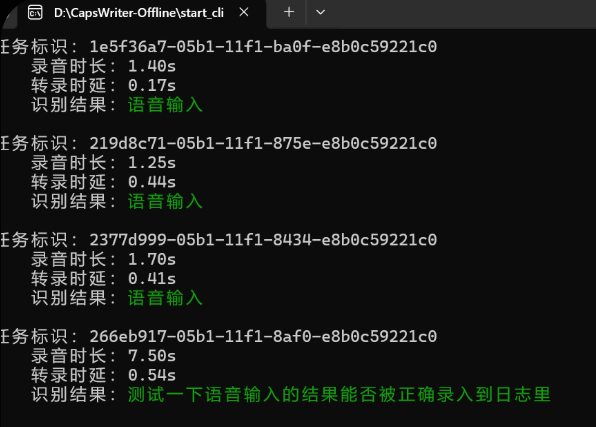

  

# Input-Stream-Logger

  

> **基于 Rime 输入法与 CapsWriter 的本地输入收集方案**

> 无感记录你的每一次按键与语音，为个人 AI 知识库构建提供原始数据集。

注：本项目构建日期为3.23日，后续开源项目可能会做修改导致不适配

---

  

## 1. 前置准备


### Rime (小狼毫) 安装

- **下载地址**：[Rime Weasel Release](https://github.com/rime/weasel/releases)

- **安装建议**：建议安装到非系统盘（如 `D:\Rime_Config`），方便后续管理配置。

- **输入方案**：初步配置选“朙月拼音·简化字”即可，本项目后续配置文件也是基于这个选项。


<details>

<summary> <b>展开：如何将 Rime 设置为 Windows 默认输入法 (Win11)</b></summary>

  

1. 按下 `Win + I` 打开 **设置**。

2. 点击左侧的 **“时间和语言”** > 右侧的 **“输入”**。

3. 点击 **“高级键盘设置”**。

4. 在 **“替代默认输入法”** 下拉菜单中，选择：**`中文(简体) - 小狼毫`**。

  

</details>


## 2. Rime 输入法配置

> **原理**：利用 Rime 的 patch 机制挂载 Lua 脚本，监听每一次文本上屏动作。

我们已经为你准备好了两个关键文件，位于项目的 `Rime_Config` 目录下：

1.  [`luna_pinyin_simp.custom.yaml`](./Rime_Config/luna_pinyin_simp.custom.yaml)  (拦截器配置开关)
2.  [`rime.lua`](./Rime_Config/rime.lua)  (核心逻辑脚本)


将上述两个文件，直接**复制并覆盖**到你的 Rime 用户文件夹根目录（如果按照上面说的自定义的话是 `D:\Rime_Config` ，如果按照软件默认设置应该是类似 `%APPDATA%\Rime`的形式）。

####  **重要：修改日志存储路径！**

`rime.lua` 文件中默认将日志存放在 D 盘。**如果你的电脑没有 D 盘，或者想自定义位置，请务必修改！**

👉 **操作方法**：
用记事本打开 `rime.lua`，找到 **第 7 行**：
```lua
-- 【注意】这里必须是你电脑上真实存在的文件夹路径
local path = "D:\\my_log\\" .. date .. ".txt"
```

我们将路径修改为你想要的文件夹（例如 `C:\\Users\\User\\Documents\\`）。
**注意：Windows路径中的反斜杠 `\` 需要写成双斜杠 `\\` 转义！**

#### **3. 生效配置：重新部署**

完成以上文件替换与路径修改后，为了让配置生效，你需要：
1. 在 Windows 任务栏右下角找到 Rime（小狼毫）图标。
2. **右键** 点击图标，选择 **“重新部署” (Redeploy)**。
3. 等待几秒钟，直到提示部署成功。



---

## 3. 最终效果展示

配置成功后，你在电脑上输入的每一段文字都会被实时记录到你指定的日志文件中。

**日志示例：**




## 3. 语音模块：CapsWriter-Offline
为了解决“不想打字”时的输入问题，引入了本地语音识别。

- **工具介绍**：GitHub 开源工具，利用 Whisper 模型本地识别。
- **操作流程**：
    1. 按住 `CapsLock` 说话。
    2. 松开，几百毫秒内转文字。
    3. **关键点**：通过模拟键盘输入上屏，所以能被 Rime 的 Lua 脚本完美抓取。
## 免责声明与致谢 (Credits)

本项目作为 [CapsWriter-Offline](https://github.com/HaujetZhao/CapsWriter-Offline) 的非官方配置补丁存在。

- **核心功能**：CapsWriter 软件本体版权归原作者 **[HaujetZhao](https://github.com/HaujetZhao)** 所有。
- **本仓库内容**：仅包含针对特定需求的 Rime 配置文件与 Python 脚本修改片段。
- **使用方式**：本项目不分发 CapsWriter 软件实体，请用户自行前往原仓库下载。

#### **下载和配置**
- **下载链接**：[Releases · HaujetZhao/CapsWriter-Offline](https://github.com/HaujetZhao/CapsWriter-Offline/releases)

1. **运行程序**：运行目录底部的两个 `.exe` 文件（Server 和 Client）。
2. **下载模型**：初次运行需要下载模型文件。

3. **获取模型**：可以从作者提供的百度网盘下载对应模型（如 `Fun-ASR-Nano`）。



解压完之后路径看起来应该是这样的：
D:\CapsWriter-Offline\models\Fun-ASR-Nano\Fun-ASR-Nano-GGUF

为了让语音输入的内容也被抓取到日志里，我们需要修改配置文件config_client.py
paste这里需要是False
```
threshold    = 0.3          # 快捷键触发阈值（秒）
paste        = False        # 是否以写入剪切板然后模拟 Ctrl-V 粘贴的方式输出结果
restore_clip = True         # 模拟粘贴后是否恢复剪贴板
```
**语音输入界面展示：**



将语音识别内容抓取到刚才打字的日志中：

- **仓库文件路径**：[`CapsWriter-Offline/util/client/output/result_processor.py`](./CapsWriter-Offline/util/client/output/result_processor.py) (点击可直接跳转)
- **本地路径参考**：`D:\CapsWriter-Offline\util\client\output\result_processor.py`

请使用仓库中的代码 **全部覆盖** 你本地的同名文件即可。


顺便一提，我目前的配置会导致每段语音都被录制并一条一条的存放在格式类似D:\CapsWriter-Offline\2026的文件夹下，按照月份分类。占空间很大可以定期去删掉
倒是可以通过某种筛选直接作为训练个人ai语音的素材了，还省去的文字校对的工作。不过这个暂时不管。


**日志混合展示：**


> **PS**：开机时首次使用的延时较久是正常的，模型加载完之后后续的识别就很快了。


## 4. 后端处理：日志清洗与 AI 知识库构建

> **说明**：此模块负责将 Rime 收集的原始碎片化日志，通过本地清洗与 AI 智能分类，转化为结构化知识。相关代码位于项目 [`my_log/`](./my_log/) 目录下。

### 0. 环境准备

在使用后端处理工具前，请确保已安装必要的 Python 依赖并配置 API 密钥：

```bash
cd my_log
pip install -r requirements.txt
cp .env.example .env
# 然后编辑 .env 文件，填入你的 API_KEY
```

### 1. 概述

本工具将日志处理分为两个独立步骤：
1. **本地合并处理** (`merge_logs.py`) - 将零散的语音转录片段按时间戳合并成完整句子
2. **AI 数据提取** (`process_with_ai.py`) - 调用在线 API 对合并后的句子进行智能分析和提取

这种分离设计允许你在两个步骤之间手动进行数据脱敏或编辑。

---

## 工作流程

### 步骤 1: 本地合并处理

运行 `merge_logs.py` 将原始日志合并成句子：

```bash
# 处理今天的日志（默认）
python merge_logs.py

# 处理指定日期的日志
python merge_logs.py 2026-02-11
```

**输入文件**: `YYYY-MM-DD.txt` (原始语音转录日志)

**输出文件**: `merged_YYYY-MM-DD.txt` (合并后的句子)

**配置参数** (在 `merge_logs.py` 的 CONFIG 中调整):
- `MERGE_THRESHOLD`: 5.0 秒 - 两个片段间隔超过此值视为新句子
- `LOG_DIR`: "." - 输入日志所在目录
- `OUTPUT_DIR`: "." - 输出文件保存目录

**合并规则**:
- 自动过滤无意义字符 (如 "sil", "/", "，", "。" 等)
- 移除 `[VOICE]` 标记
- 根据时间间隔智能合并碎片化内容
- 保留时间戳以便追溯

---

### 步骤 2: 手动脱敏（可选）

在这一步，你可以打开 `merged_YYYY-MM-DD.txt` 文件，手动：
- 删除敏感信息（如姓名、电话、账号等）
- 修正识别错误的内容
- 调整或删除不需要处理的句子

---

### 步骤 3: 话题嗅探（Topic Router）

运行 `topic_router.py` 调用 AI 扫描日志全文，将不同时段的话题进行分类和划界。

```bash
# 处理今天的合并日志（默认）
python topic_router.py

# 处理指定日期的合并日志
python topic_router.py 2026-02-11
```

**输入文件**: `merged_YYYY-MM-DD.txt` (步骤 1 或 2 的输出)
**输出文件**: `topics_YYYY-MM-DD.json` (结构化的话题列表)

**配置参数** (在 `topic_router.py` 和 `conditional_summarizer.py` 的 CONFIG 中调整):
- `API_KEY`: 你的 API 密钥
- `BASE_URL`: API 端点地址
- `MODEL_NAME`: 使用的模型名称

---

### 步骤 4: 分类处理（Conditional Summarizer）

运行 `conditional_summarizer.py`，根据上一步划分的话题类型，对每个话题块采用不同的清洗或总结策略。

```bash
# 处理今天的话题（默认）
python conditional_summarizer.py

# 处理指定日期的话题
python conditional_summarizer.py 2026-02-11
```

**输入文件**: `merged_YYYY-MM-DD.txt` 和 `topics_YYYY-MM-DD.json`
**输出文件**: `summary_YYYY-MM-DD.txt` (最终生成的结构化内容)

**处理策略**:
- **读书/论文等外部知识**: 极简保留法（只记录时间和名字，具体细节已另有记录）。
- **软件配置/项目实践**: 深度榨取法（梳理：需求/目的 -> 尝试方法/踩坑 -> 最终结论）。

---

## 完整示例

假设你要处理 2026-02-12 的日志：

```bash
# 1. 本地合并
python merge_logs.py 2026-02-12
# 生成: merged_2026-02-12.txt

# 2. 手动脱敏（可选）
# 用文本编辑器打开 merged_2026-02-12.txt 进行编辑

# 3. 话题嗅探
python topic_router.py 2026-02-12
# 生成: topics_2026-02-12.json

# 4. 分类总结
python conditional_summarizer.py 2026-02-12
# 生成: summary_2026-02-12.txt
```

---

## 文件说明

### 原始文件
- `YYYY-MM-DD.txt` - 原始语音转录日志
  ```
  [10:00:01] 我
  [10:00:02] 先
  [10:00:03] 打开
  [10:00:04] 这个
  [10:00:05] 文件
  ```

### 合并后文件
- `merged_YYYY-MM-DD.txt` - 合并后的句子
  ```
  [10:00:01] 我先打开这个文件
  ```

### AI 处理输出
- `topics_YYYY-MM-DD.json` - JSON 格式的话题划界
  ```json
  [
    {"start_time": "10:00", "end_time": "10:30", "topic_type": "读书笔记", "topic_name": "《某本书》"},
    {"start_time": "10:35", "end_time": "11:20", "topic_type": "软件配置", "topic_name": "配置 LobeChat"}
  ]
  ```

- `summary_YYYY-MM-DD.txt` - 最终的分类总结文本
  ```markdown
  [10:00 - 10:30] 读书笔记: 《某本书》
  ...
  ```

---

## 注意事项

1. **API 限流**: 如遇到 429/403 错误，程序会自动使用指数退避策略重试
2. **数据安全**: 合并步骤在本地完成，不涉及网络传输
3. **脱敏时机**: 建议在步骤 1 和步骤 2 之间进行数据脱敏
4. **文件编码**: 所有文件使用 UTF-8 编码
5. **断点续传**: AI 处理支持断点续传，可以随时中断和恢复

---

## 常见问题

**Q: 如何调整合并的灵敏度？**
A: 修改 `merge_logs.py` 中的 `MERGE_THRESHOLD` 参数。值越大，句子合并越宽松。

**Q: AI 提取结果不理想怎么办？**
A: 可以在步骤 2 手动编辑合并后的句子，使其更清晰明确。

**Q: 如何处理 API 限流？**
A: 增大 `REQUEST_INTERVAL` 参数，或减小 `CHUNK_SIZE`。

**Q: 如何清理历史处理文件？**
A: 可以运行 [`cleanup_logs.py`](./my_log/cleanup_logs.py)，它会提示你输入日期并删除该日期对应的所有中间文件及结果。

---

### 项目代码参考 (my_log)

- [`merge_logs.py`](./my_log/merge_logs.py): **第一步**，本地合并处理，将断句缝合。
- [`topic_router.py`](./my_log/topic_router.py): **第二步**，话题嗅探器，全文话题划界。
- [`conditional_summarizer.py`](./my_log/conditional_summarizer.py): **第三步**，分类处理器，按话题类型精细总结。
- [`process_with_ai.py`](./my_log/process_with_ai.py): 旧版分块提取方案（保留参考）。
- [`cleanup_logs.py`](./my_log/cleanup_logs.py): 日志清理工具。
