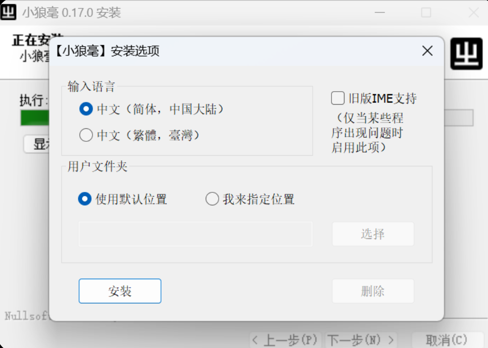
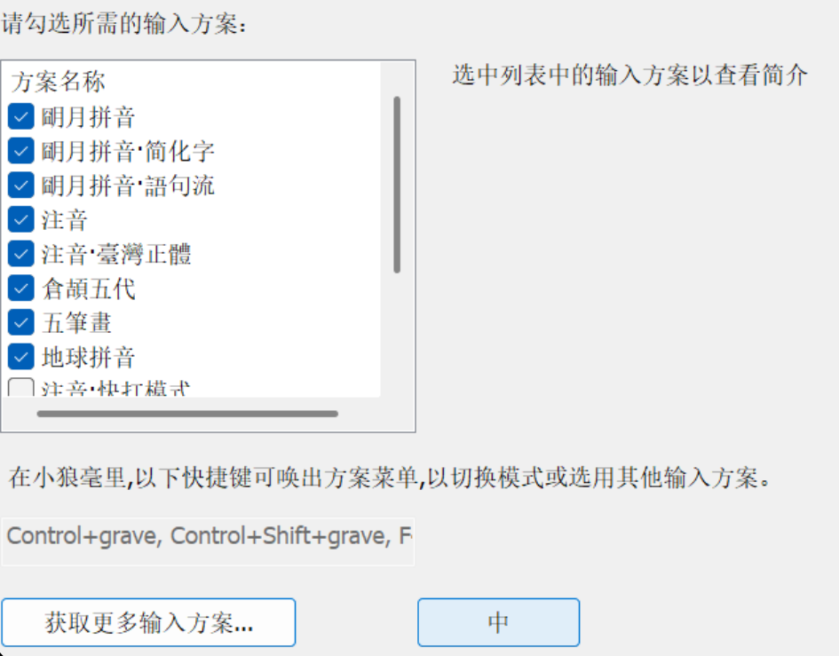
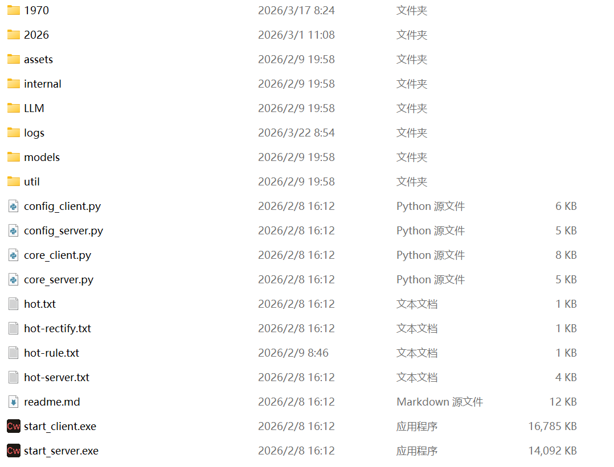
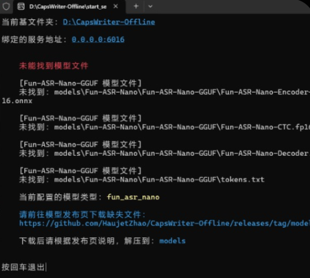

  

# Input-Stream-Logger

  

> **基于 Rime 输入法与 CapsWriter 的本地输入收集方案**

> 无感记录你的每一次按键与语音，为个人 AI 知识库构建提供原始数据集。

注：本项目构建日期为3.23日，后续开源项目可能会做修改导致不适配

---

  

## 1. 前置准备


### Rime (小狼毫) 安装

- **下载地址**：[Rime Weasel Release](https://github.com/rime/weasel/releases)

- **安装建议**：建议安装到非系统盘（如 `D:\Rime_Config`），方便后续管理配置。



- **输入方案**：初步配置选“朙月拼音·简化字”即可，本项目后续配置文件也是基于这个选项。



<details>

<summary> <b>展开：如何将 Rime 设置为 Windows 默认输入法 (Win11)</b></summary>

  

1. 按下 `Win + I` 打开 **设置**。

2. 点击左侧的 **“时间和语言”** > 右侧的 **“输入”**。

3. 点击 **“高级键盘设置”**。

4. 在 **“替代默认输入法”** 下拉菜单中，选择：**`中文(简体) - 小狼毫`**。

  

</details>


## 2. Rime 输入法配置

> **原理**：利用 Rime 的 patch 机制挂载 Lua 脚本，监听每一次文本上屏动作。

我们已经为你准备好了两个关键文件，位于项目的 `Rime_Config` 目录下：

1.  [`luna_pinyin_simp.custom.yaml`](./Rime_Config/luna_pinyin_simp.custom.yaml)  (拦截器配置开关)
2.  [`rime.lua`](./Rime_Config/rime.lua)  (核心逻辑脚本)


将上述两个文件，直接**复制并覆盖**到你的 Rime 用户文件夹根目录（如果按照上面说的自定义的话是 `D:\Rime_Config` ，如果按照软件默认设置应该是类似 `%APPDATA%\Rime`的形式）。

####  **重要：修改日志存储路径！**

`rime.lua` 文件中默认将日志存放在 D 盘。**如果你的电脑没有 D 盘，或者想自定义位置，请务必修改！**

👉 **操作方法**：
用记事本打开 `rime.lua`，找到 **第 7 行**：
```lua
-- 【注意】这里必须是你电脑上真实存在的文件夹路径
local path = "D:\\my_log\\" .. date .. ".txt"
```

我们将路径修改为你想要的文件夹（例如 `C:\\Users\\User\\Documents\\`）。
**注意：Windows路径中的反斜杠 `\` 需要写成双斜杠 `\\` 转义！**

#### **3. 生效配置：重新部署**

完成以上文件替换与路径修改后，为了让配置生效，你需要：
1. 在 Windows 任务栏右下角找到 Rime（小狼毫）图标。
2. **右键** 点击图标，选择 **“重新部署” (Redeploy)**。
3. 等待几秒钟，直到提示部署成功。


---

## 3. 最终效果展示

配置成功后，你在电脑上输入的每一段文字都会被实时记录到你指定的日志文件中。

**日志示例：**


## 3. 语音模块：CapsWriter-Offline
为了解决“不想打字”时的输入问题，引入了本地语音识别。

- **工具介绍**：GitHub 开源工具，利用 Whisper 模型本地识别。
- **操作流程**：
    1. 按住 `CapsLock` 说话。
    2. 松开，几百毫秒内转文字。
    3. **关键点**：通过模拟键盘输入上屏，所以能被 Rime 的 Lua 脚本完美抓取。
## 免责声明与致谢 (Credits)

本项目作为 [CapsWriter-Offline](https://github.com/HaujetZhao/CapsWriter-Offline) 的非官方配置补丁存在。

- **核心功能**：CapsWriter 软件本体版权归原作者 **[HaujetZhao](https://github.com/HaujetZhao)** 所有。
- **本仓库内容**：仅包含针对特定需求的 Rime 配置文件与 Python 脚本修改片段。
- **使用方式**：本项目不分发 CapsWriter 软件实体，请用户自行前往原仓库下载。

#### **下载和配置**
- **下载链接**：[Releases · HaujetZhao/CapsWriter-Offline](https://github.com/HaujetZhao/CapsWriter-Offline/releases)
- **文件夹结构**：下载并解压后，目录结构如下所示：



1. **运行程序**：运行目录底部的两个 `.exe` 文件（Server 和 Client）。
2. **下载模型**：初次运行需要下载模型文件。



3. **获取模型**：可以从作者提供的百度网盘下载对应模型（如 `Fun-ASR-Nano`）。


解压完之后路径看起来应该是这样的：
D:\CapsWriter-Offline\models\Fun-ASR-Nano\Fun-ASR-Nano-GGUF

为了让语音输入的内容也被抓取到日志里，我们需要修改配置文件config_client.py
paste这里需要是False
```
threshold    = 0.3          # 快捷键触发阈值（秒）
paste        = False        # 是否以写入剪切板然后模拟 Ctrl-V 粘贴的方式输出结果
restore_clip = True         # 模拟粘贴后是否恢复剪贴板
```
**语音输入界面展示：**


将语音识别内容抓取到刚才打字的日志中：

- **仓库文件路径**：[`CapsWriter-Offline/util/client/output/result_processor.py`](./CapsWriter-Offline/util/client/output/result_processor.py) (点击可直接跳转)
- **本地路径参考**：`D:\CapsWriter-Offline\util\client\output\result_processor.py`

请使用仓库中的代码 **全部覆盖** 你本地的同名文件即可。


顺便一提，我目前的配置会导致每段语音都被录制并一条一条的存放在格式类似D:\CapsWriter-Offline\2026的文件夹下，按照月份分类。占空间很大可以定期去删掉
倒是可以通过某种筛选直接作为训练个人ai语音的素材了，还省去的文字校对的工作。不过这个暂时不管。


**日志混合展示：**


> **PS**：开机时首次使用的延时较久是正常的，模型加载完之后后续的识别就很快了。


## 5. 后端处理：日志清洗与 AI 知识库构建
（待补充）
